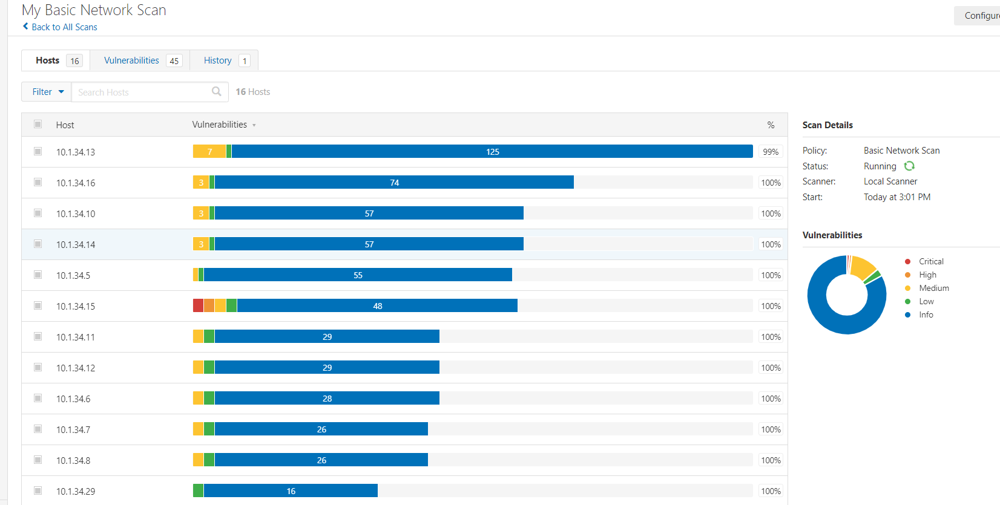
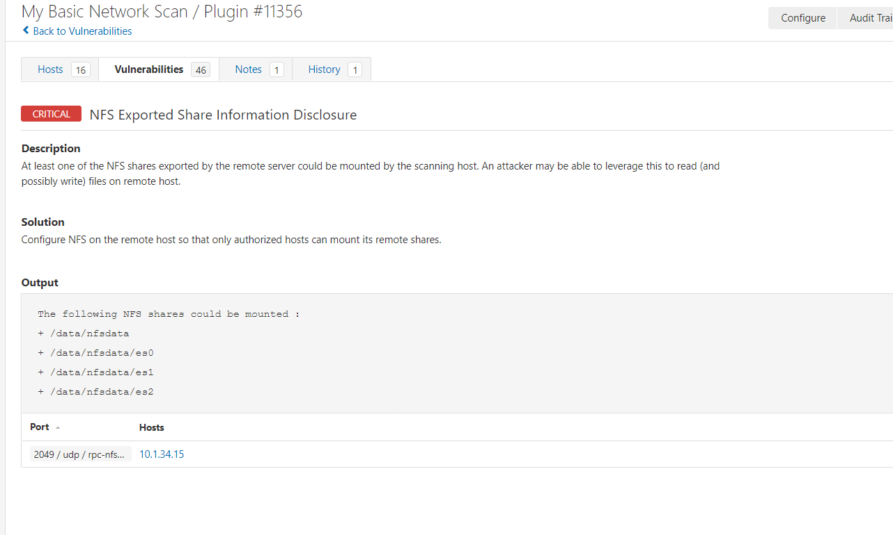

### nessus 扫描器

#### 运行容器
```
docker run -d --name nessus --mount source=nessus,target=/config -e PUID=99 -e PGID=100 -p 8834:8834 jbreed/nessus

[comment]: <> (访问 https://{$ip}:8834)

```
扫描截图:

 

漏洞详情:
 