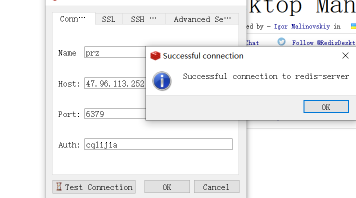
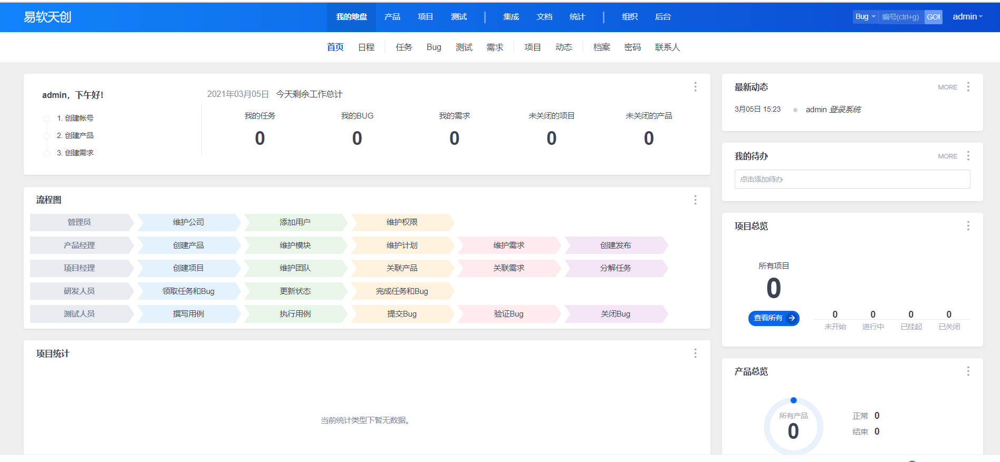
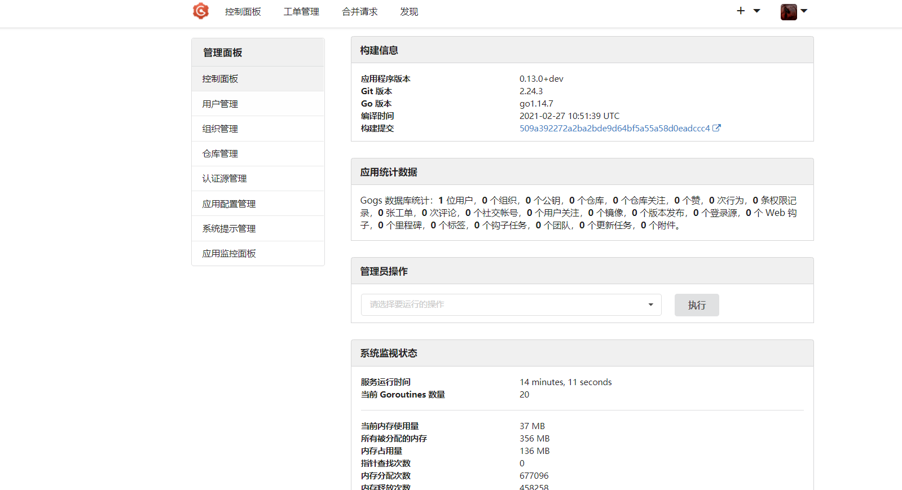

### all-01
说明:
```
只是将几个镜像打包在一起 技术性不高,实用性极强
1.一次性部署 禅道 git服务器 mysql:5.7 redis:5.0.8
2.mysql初始化sql:all-01/gogs/init.sql my.cnf修改:all-01/mysql-config/my.cnf
3.redis更改配置文件:all-01/redis-config/redis.conf
```

验证mysql配置文件是否更改


需要配置密码才能连接redis


禅道社区版本



gogs git服务器


