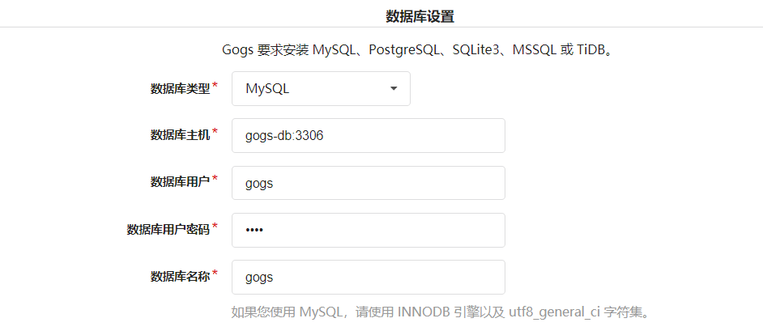

### gogs介绍
Gogs 是一款极易搭建的自助 Git 服务。

官网:https://gogs.io/docs

使用docker-compose进行安装 使用mysql作为数据存储 

mysql数据目录挂载 

gogs数据目录挂载

初始化mysql创建gogs数据库 init.sql (未创建相关用户 也可以自己更改sql为gogs创建单独的连接账户和密码)

安装时连接数据库名使用docker-compose里指定的服务名 端口仍为3306 映射出的53306是方便后期远程连接

 

ssh 端口号和http端口后 配置为映射后的10022 和10080
 
