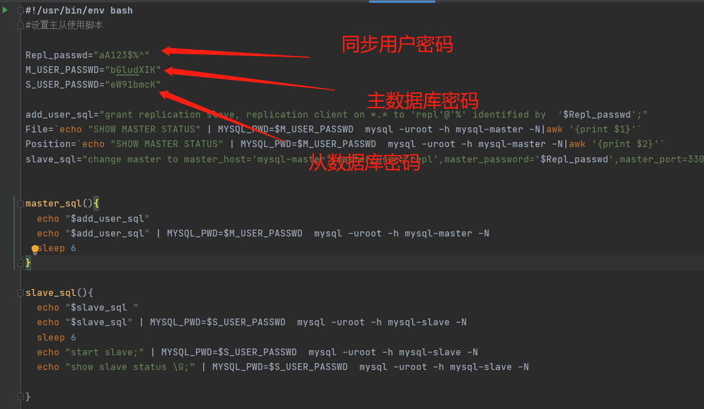

### 主从配置说明
```
 只需更改start.sh执行 即可部署主从数据库
网络连接使用docker-compose之间的服务名调用
```

#### 部署
```
1.docker-compose up 
2.修改start.sh脚本中对应的数据库密码 
3.docker cp start.sh mysql-slave:/tmp
4.docker exec -it mysql-slave bash
5.sh /tmp/start.sh
6.验证主从是否同步
```

##### start.sh配置说明
 

##### 验证主从是否同步
````
1.主库执行create_mysql_table.sql 
2.验证从库是否同步相关数据
````

#### 其他
```
slave.conf中配置 即可指定需要同步的数据库
#replicate-do-db = db1
read_only=1  #设置从库只读 root用户一样可以写入 需要限制root则需要添加下面配置
super_read_only=1
```