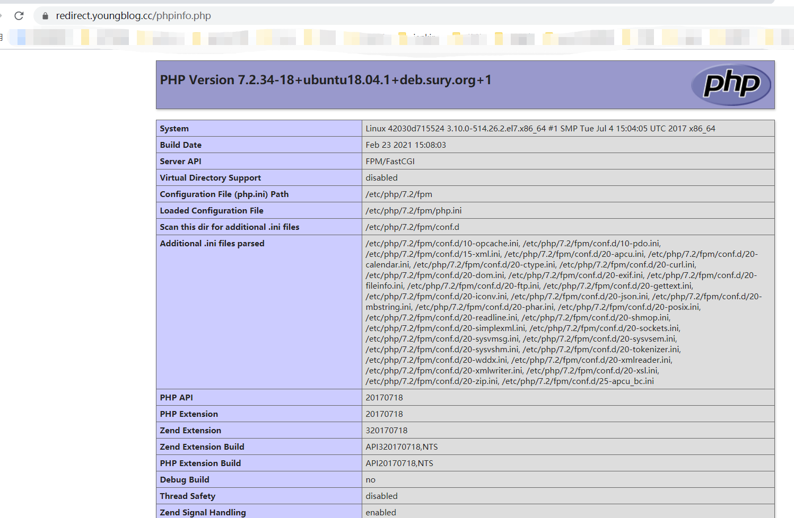

### php运行环境 
```
只有php-fpm 和nginx环境 方便快速部署一些php相关的项目
1.包含80和443端口的配置 根据自己的需求更改nginx的配置文件php-nginx/www/conf/*.conf
2.默认包含phpinfo页面 访问 http://{ip}/phpinfo.php 即可
3.默认php版本为php72-fpm 可用版本有 80 74 73 72 71 7 56 更改镜像版本即可 参考https://hub.docker.com/u/phpdockerio
```

##### php info

 