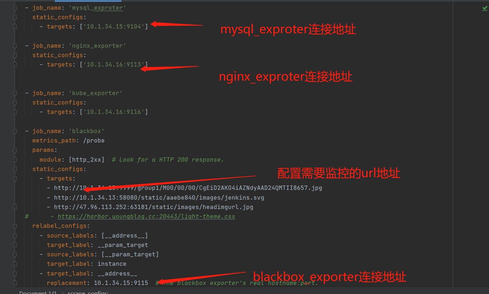
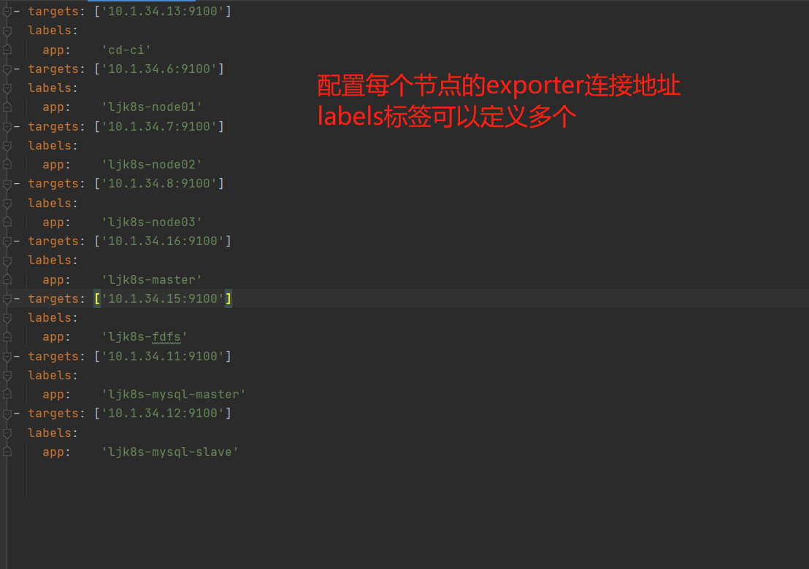
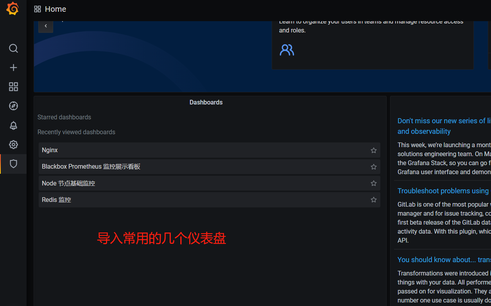
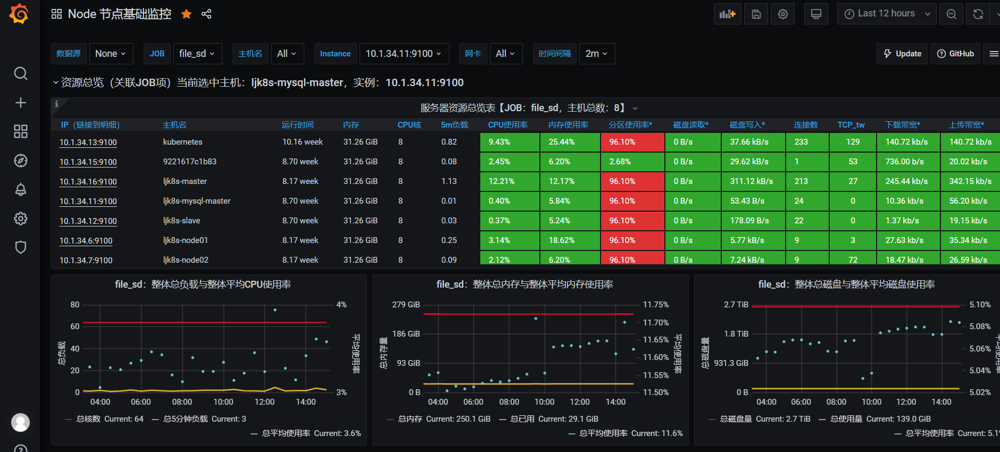
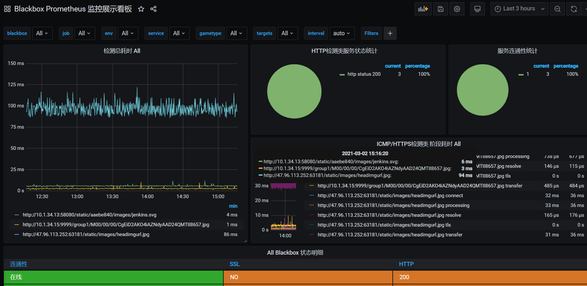
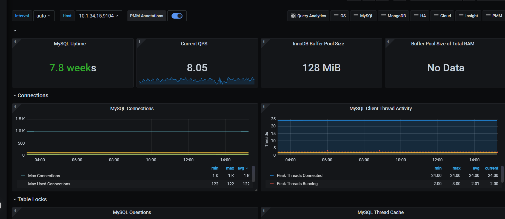

### prometheus 监控

原项目地址: https://github.com/vegasbrianc/prometheus


更改内容:
```
1.增加mysql监控
2.增加redis监控
3.增加blackbox http监控
4.增加nginx监控
5.修改报警规则为中文
6.python介绍报警信息推送到企业微信
7.增加grafana监控模板
```

配置说明:
#### exporter安装
```
介绍直接安装使用的方法:

node_exporter安装 
    docker: docker run -d --restart=always  --net="host"   --pid="host"   -v "/:/host:ro,rslave"   quay.io/prometheus/node-exporter:latest   --path.rootfs=/host
    docker运行 node_exporter 使用--pid="host" 与主机同一个命名空间 即可获取主机的/proc信息进行监控
mysql_exporter安装
    docker: docker network create my-mysql-network && docker run -d   -p 9104:9104  --network my-mysql-network  -e DATA_SOURCE_NAME="exporter:aA123$%^@(10.1.34.11:3306)/"   prom/mysqld-exporter
    mysql连接地址: DATA_SOURCE_NAME="exporter:aA123$%^@(10.1.34.11:3306)/" 
reidis_exporter安装
    二进制运行: ./redis_exporter/redis_exporter -redis.addr="redis://10.1.34.13:6379" -redis.password="cqlijia"
    redis连接地址:redis://10.1.34.13:6379  redis密码: cqlijia
nginx_exproter安装
    docker:docker run -d -p 9113:9113 nginx/nginx-prometheus-exporter:0.8.0 -nginx.scrape-uri http://10.1.34.16:6888/nginx_status
    http://10.1.34.16:6888/nginx_status 为nginx配置的ngx_status模块
blackbox-exporter安装
    docker:docker run --rm -d -p 9115:9115 --name blackbox_exporter -v `pwd`:/config prom/blackbox-exporter:master --config.file=/config/blackbox.yml
    --config.file=/config/blackbox.yml 指定的配置文件为 promethus/exporter/blackbox_exporter/blackbox.yml
    
详细使用请参考github
node_exporter: https://github.com/prometheus/node_exporter
mysql_exporter: https://github.com/prometheus/mysqld_exporter
reidis_exporter:  https://github.com/oliver006/redis_exporter
nginx_exproter: https://github.com/nginxinc/nginx-prometheus-exporter
blackbox-exporter: https://github.com/prometheus/blackbox_exporter


```

#### prometheus配置文件说明
```
所有配置文件都已经集成好了 
redis mysql nginx 需要在 promethus/prometheus/prometheus.yml 更改对应exproter对应的地址

node监控节点可能会比较多 使用文件发现的配置需要在 promethus/prometheus/nodes/nodes.yaml 下配置
```
更改mysql redis nginx的配置  promethus/prometheus/prometheus.yml
 

配置连接node节点的连接配置 promethus/prometheus/nodes/nodes.yaml 
 


#### 报警配置
```
1.运行alert.py  python2.7 alert.py 将监听39092 端口
2.在 promethus/alertmanager/config.yml 中配置webhook_configs接口地址如 http://10.1.34.13:39092/send

报警脚本将会打印出alertmanager 传入的request.data 如需要更改报警信息 请对应修改即可

```

#### 运行并导入监控模板
```
已经添加默认的 grafana 需要使用的仪表盘 安装后进入grafana即可看到默认导入的几个仪表盘

```
如图:
 


##### reload重新加载
```
curl --location --request POST 'http://10.1.34.15:9090/-/reload'
```

##### 监控效果图

主机监控


http监控
 

mysql监控
 