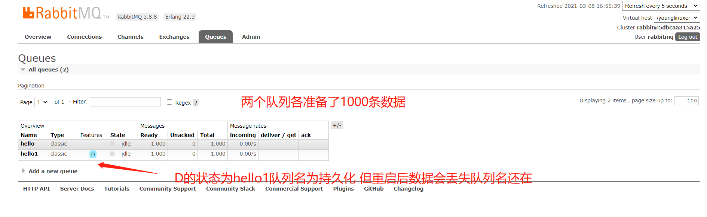

#### rabbitmq
docker-compose来源:https://github.com/bitnami/bitnami-docker-rabbitmq
python来源:https://www.cnblogs.com/shenh/p/10497244.html

```
1.部署rabbitmq单机
2.python 测试rabbitmq相关脚本 
```

send.py 发送1000条订单数据到rabbitmq 

receice.py 读取rabbitmq队列中的数据

测试:运行send.py往rabbitmq中添加数据 运行receice.py进行消费读取


 