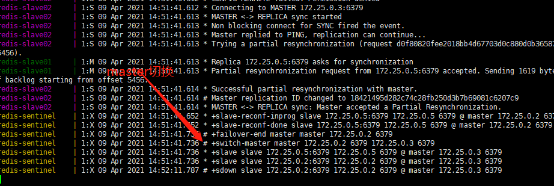
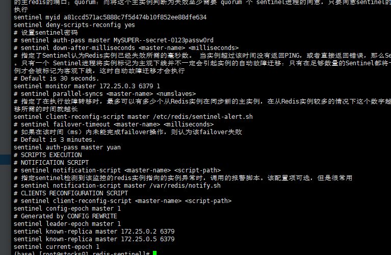
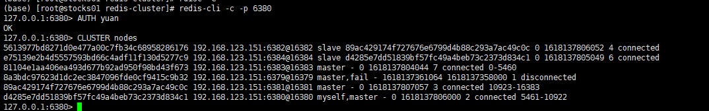
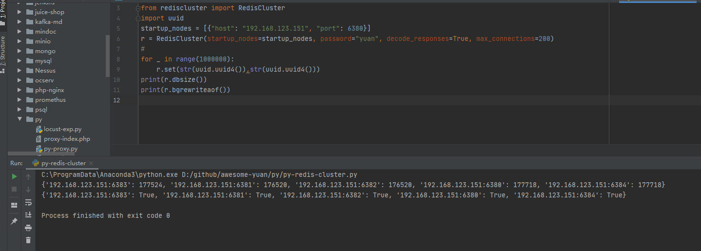

### redis

#### redis单机版
```
redis-stand-alone 目录下
同时开启rdb和 aof持久化 持久化目录挂载至./data 目录 
设置密码为 requirepass  yuan  限制内存 maxmemory 751619276
bind 默认为0.0.0.0 处于安全考虑可以更改为当前服务器IP 
-
```

#### redis主从
```
一主两从模式 未开启哨兵 使用docker-compose的服务名进行通信
master配置不变 slave节点添加如下配置 redis-master为master的通信地址 yuan为master节点的redis密码  
slaveof redis-master 6379
masterauth  yuan

验证: 
进入master redis-cli -p 6379 添加数据 ,MSET name younglinuxer location cq  linux Kali_Linux 
进入slave节点 redis-cli -p 6380 查看相关数据是否存在  keys *

注意操作前需要认证 AUTH yuan
```
查看主从同步状态 docker-compose logs -f reids-master

 


#### 哨兵
```
单个哨兵实现：包含详细配置及说明
三个哨兵实现 ：优化三个哨兵运行的相关参数
运行docker-compose stop redis-master 观察日志切换master后连接其他redis实例 验证主从是否切换;
运行docker-compose start redis-master 后进入原来的master 验证原master 已经变为从(只读 无法写入数据)
注意事项: 
master 配置文件添加 masterauth  yuan 防止master停止后 又启动时无非加入新的集群模式
哨兵端口为20000 + redis端口


另外 redis很少有场景用会存在磁盘io瓶颈(除非实时写入磁盘的aof配置) 主从架构貌似也只是为了数据备份而使用 好像没有类似读写分离的场景(待验证) 哨兵也仅仅是主从的高可用架构  

```
哨兵切换过程



切换完成后哨兵配置文件的变化
 



#### redis集群

```
docker-compose 设定6个实例运行会造成通信问题 cluster使用host的网络模式运行分配6个不同的配置文件
运行集群：
1.docker-compose up -d
2.docker-compose exec -it redis-node01 bash
#根据实际情况修改IP 地址
3.redis-cli -a yuan --cluster create 192.168.123.151:6379 192.168.123.151:6380 192.168.123.151:6381 192.168.123.151:6382 192.168.123.151:6383 192.168.123.151:6384  --cluster-replicas 1

4.如果需要分不同服务器运行集群 可直接将docker-compose.yml和配置文件进行拆分 放不同服务器运行即可

下列验证图片只有5个实例 因为写入数据中 我停止了redis-node01 验证集群主从切换功能
```

redis cluster 集群信息 



redis cluster python 脚本验证 分片信息




##### 持久化 rdb aof
```
aof
appendfsync everyse/always/no (默认每秒)
```

##### python脚本 (几种常见类型的例子)
```
详见 py目录 reidis.*.py
```