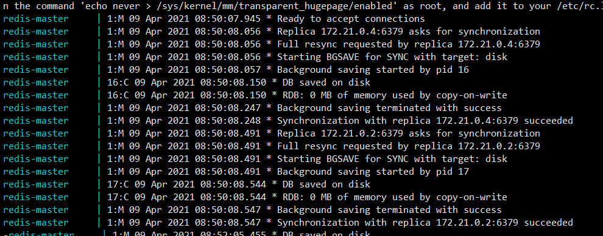

### redis

#### redis单机版
```
redis-stand-alone 目录下
同时开启rdb和 aof持久化 持久化目录挂载至./data 目录 
设置密码为 requirepass  yuan  限制内存 maxmemory 751619276
bind 默认为0.0.0.0 处于安全考虑可以更改为当前服务器IP 
-
```

#### redis主从
```
一主两从模式 未开启哨兵 使用docker-compose的服务名进行通信
master配置不变 slave节点添加如下配置 redis-master为master的通信地址 yuan为master节点的redis密码  
slaveof redis-master 6379
masterauth  yuan

验证: 
进入master redis-cli -p 6379 添加数据 ,MSET name younglinuxer location cq  linux Kali_Linux 
进入slave节点 redis-cli -p 6380 查看相关数据是否存在  keys *

注意操作前需要认证 AUTH yuan
```
查看主从同步状态 docker-compose logs -f reids-master
 


#### 哨兵

```

```

#### redis集群

```

```

##### 持久化 rdb aof
```

aof
appendfsync everyse/always/no (默认每秒)
```