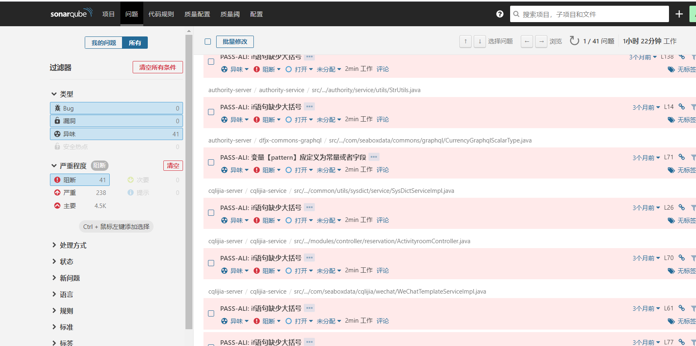
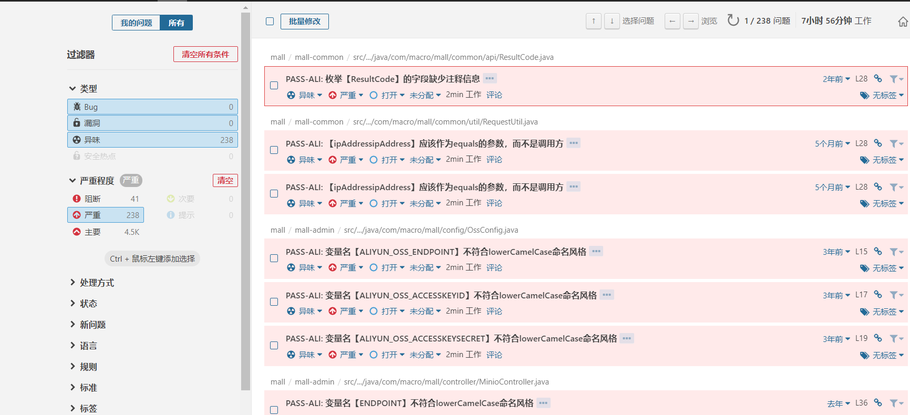

#### sonar 代码检查
使用阿里p3c检查规则对代码进行检查

参考:

p3c https://github.com/mrprince/sonar-p3c-pmd

l10n-zh https://github.com/xuhuisheng/sonar-l10n-zh

docker-compose: https://github.com/marvinpuethe/docker-sonarqube-mysql

p3c制作参考:https://www.jianshu.com/p/a3a58ac368be

```
sonarqube:7.4-community
mysql:5.7
pmd:3.0.1
p3c:1.3.6
l10n-zh:1.24
```

### install
```
1.运行docker-compose up
2.将plugin下的jar包复制到容器sonarqube_sonarqube_1中/extensions/plugins下
3.重启sonarqube docker-compose restart sonarqube 
4.配置规则参考 https://www.jianshu.com/p/a3a58ac368be

```
### 代码扫描结果 

 

 